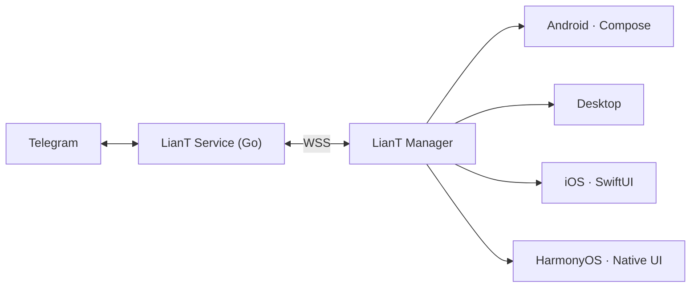

<div align="center">

<a href="https://github.com/Bailensn">
  
</a>

**Bailensn** · 异或

`Student Developer` · `Open Source Enthusiast`

<sub>LensnTeam · 异山工作室</sub>

<br />

<sub>Building software, breaking software, and occasionally understanding why it works.</sub>

<br /><br />

<a href="https://github.com/Bailensn"></a>
<a href="https://github.com/LensnTeam"></a>


</div>

---

## `/ about`

```console
$ whoami
Bailensn (异或)

$ cat role
Student Developer · Open Source Developer · Independent Builder

$ cat interests
linux, android, servers, self-hosting, open source,
low-level software, modern UI, new languages

$ cat workflow
small idea → rough prototype → rewrite → actual project
```

I'm a student developer who likes taking software apart and putting it back together.
Most of what I build starts as a tiny idea, then slowly turns into something real —
a bot manager, a roll-call tool, a small Android utility.

I like owning the stack: writing the code, running the server, deploying the service,
and fixing it when it breaks at 2 a.m.

---

## `/ currently building`

```text
→ LianT                  open-source, self-hosted Telegram Bot API manager
→ Modern Android UI      Jetpack Compose · Material 3 · animation
→ Go projects            services, tools, small experiments
→ Linux / server         self-hosted infra, networking, reverse proxy
→ Exploring Zig          a language I keep coming back to
→ Exploring desktop UI   Compose Multiplatform / SwiftUI
```

---

## `/ featured projects`

### LianT · 联T

**An open-source, self-hosted Telegram Bot API manager.**

> Making the Telegram Bot API feel less like a raw endpoint
> and more like a service you actually manage.

`Open Source` · `Self-hosted` · `Privacy-oriented` · `Multi-Service` · `Modern UI`

<p>
<a href="https://github.com/LensnTeam/LianT">
  
</a>


</p>

<div align="center">

<a href="https://github.com/LensnTeam/LianT">
  
</a>

</div>

**Structure**

```text
LianT
├── Manager   → client apps, shared business logic
├── Service   → server side
└── Pages     → web / pages layer
```

`Service` is the server-side component: Telegram Bot API handling, bot relay,
temporary storage, sessions, authentication and network communication — written in **Go**,
deployed with **Docker**, self-hosted.

`Manager` is the client: Android first, then Desktop, iOS and HarmonyOS.

**Technical keywords**

`Go` · `Docker` · `Telegram Bot API` · `WSS` · `WebSocket` · `Session`
`Authentication` · `Challenge-Response` · `Temporary Token` · `Self-hosted`

**Security design (brief)**

Credential handling uses challenge-response with temporary credentials, and
`ChaCha20-Poly1305` for encrypted transport payloads. The full design lives in the repo —
this README stays a README.

---

### Dming

**An attendance / roll-call application.**

One very small idea, rewritten until it became a full software project:

```text
V1  Bash
V2  Bash + student mapping
V3  HTML
V4  Native app
V5  FluxUI + backend
```

No repository card here — the code isn't public yet.

---

### 异山工具箱

**An Android utility collection.**

Small tools that do one thing each, built with `Kotlin` + `Jetpack Compose`.
Secondary project, still growing.

---

## `/ lian t architecture`



**Same business. Different experience.**

```text
                 LianT
                   │
            Common Business Logic
                   │
       ┌───────────┼───────────┐
       │           │           │
    Android     Desktop    iOS / Harmony
       │           │           │
    Compose    Desktop UI   Native UI
```

One product doesn't have to look the same on every platform.
The business logic stays as consistent as possible; the UI is designed per platform.

---

## `/ tech stack`

**Currently working with**

<p>


</p>

**Exploring**

<p>


</p>

`Zig` · `Compose Multiplatform` · `SwiftUI` · `system programming` · `networking` ·
`self-hosted infrastructure` · `modern UI`

**Android**

<p>


</p>

`Kotlin` · `Android SDK` · `Material 3` · `KernelSU` · `Termux` · `Termux:X11` —
I care about modern, component-based and responsive UI: animation, Material 3,
and layouts that behave on any screen.

**Linux / Server**

<p>


</p>

`Debian` · `Ubuntu` · `CentOS` · `Apache` · `SSH` · `IPv6` · `reverse proxy` ·
`git server / bare repository` · `self-hosted`

I like owning the whole thing: deploy it, configure it, compile it, patch it, keep it running.
Self-hosted, open source, free software — control and hackability over convenience.

No percentage bars, no fake proficiency levels — just things I use, things I'm learning,
and things I'd like to understand better.

---

## `/ github activity`

<div align="center">


<br /><br />


</div>

<div align="center"><sub>Top languages reflect what I write most, not how good I am at it.</sub></div>

---

## `/ contributions`

<div align="center">


<br /><br />


</div>

---

## `/ development philosophy`

```text
Build first.
Understand later.

Rewrite when necessary.

Open source when possible.
Self-host when practical.

Same business.
Different experience.

Still learning.
Still building.
```

---

## `/ links`

- GitHub — [@Bailensn](https://github.com/Bailensn)
- Organization — [LensnTeam](https://github.com/LensnTeam)
- Main project — [LensnTeam/LianT](https://github.com/LensnTeam/LianT)

<div align="center">
<br />
<sub>异或 · Bailensn — still learning, still building.</sub>
</div>
